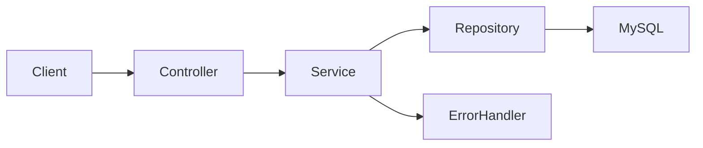

# Student Management API

REST API per la gestione persistente di studenti, sviluppata con Spring Boot, JDBC Template e MySQL. Il progetto applica un'architettura a livelli, validazione dei payload e gestione centralizzata degli errori.

## Competenze dimostrate

- progettazione di endpoint REST coerenti;
- separazione tra controller, service e repository;
- accesso al database con query SQL parametrizzate;
- mapping manuale tra righe SQL e oggetti Java;
- DTO dedicato alle richieste;
- validazione Jakarta Bean Validation;
- transazioni applicative;
- gestione uniforme degli errori HTTP;
- recupero delle chiavi generate dal database.

## Funzionalità

- elenco di tutti gli studenti;
- ricerca di uno studente per identificativo;
- creazione di un nuovo studente;
- aggiornamento completo dei dati;
- eliminazione;
- gestione della matricola duplicata;
- rifiuto delle proprietà JSON non previste.

## Tecnologie

- Java 21
- Spring Boot 4.1
- Spring Web MVC
- Spring JDBC Template
- Jakarta Validation
- MySQL
- Maven Wrapper

## Architettura



- `StudentController`: gestisce il contratto HTTP;
- `StudentService`: applica la logica e coordina le operazioni;
- `StudentRepository`: esegue le query tramite `JdbcTemplate`;
- `StudentRequest`: definisce e valida il payload;
- `GlobalExceptionHandler`: converte le eccezioni in risposte coerenti.

## Endpoint

| Metodo | Endpoint | Descrizione | Risposta principale |
|---|---|---|---|
| `GET` | `/api/v1/students` | Elenca gli studenti | `200 OK` |
| `GET` | `/api/v1/students/{id}` | Recupera uno studente | `200 OK` |
| `POST` | `/api/v1/students` | Crea uno studente | `201 Created` |
| `PUT` | `/api/v1/students/{id}` | Aggiorna uno studente | `204 No Content` |
| `DELETE` | `/api/v1/students/{id}` | Elimina uno studente | `204 No Content` |

### Payload di esempio

```json
{
  "firstName": "Mario",
  "lastName": "Rossi",
  "matricola": "12345678",
  "age": 24,
  "university": "Sapienza Università di Roma"
}
```

Nome, cognome e università sono obbligatori. La matricola deve contenere almeno otto cifre e l'età deve essere almeno `18`.

## Error handling

L'API restituisce risposte strutturate per:

- payload non validi: `400 Bad Request`;
- studente inesistente: `404 Not Found`;
- matricola duplicata: `409 Conflict`;
- errore di persistenza: `500 Internal Server Error`.

## Database

Schema minimo compatibile con le query del repository:

```sql
CREATE DATABASE gestionale_studenti;
USE gestionale_studenti;

CREATE TABLE studenti (
    idStudent BIGINT AUTO_INCREMENT PRIMARY KEY,
    firstName VARCHAR(100) NOT NULL,
    lastName VARCHAR(100) NOT NULL,
    matricola VARCHAR(50) NOT NULL UNIQUE,
    age INT NOT NULL,
    university VARCHAR(150) NOT NULL,
    CONSTRAINT chk_student_age CHECK (age >= 18)
);
```

## Configurazione

Configura la connessione in `src/main/resources/application.properties`. Non inserire credenziali reali nel repository. Per ambienti condivisi è consigliato usare variabili d'ambiente:

```properties
spring.datasource.url=${DB_URL:jdbc:mysql://localhost:3306/gestionale_studenti}
spring.datasource.username=${DB_USERNAME:root}
spring.datasource.password=${DB_PASSWORD:}
```

## Avvio

### Requisiti

- JDK 21
- MySQL

```bash
git clone https://github.com/fabiozagaria/student-management-api.git
cd student-management-api
./mvnw spring-boot:run
```

Su Windows utilizza `mvnw.cmd spring-boot:run`. Il servizio sarà disponibile su `http://localhost:8080`.

## Limiti e sviluppi successivi

L'API non implementa ancora autenticazione o autorizzazione. I prossimi passi previsti sono test automatici, documentazione OpenAPI e Spring Security con access token e refresh token.

## Autore

Fabio Zagaria — progetto backend sviluppato durante il percorso LabForWeb.
